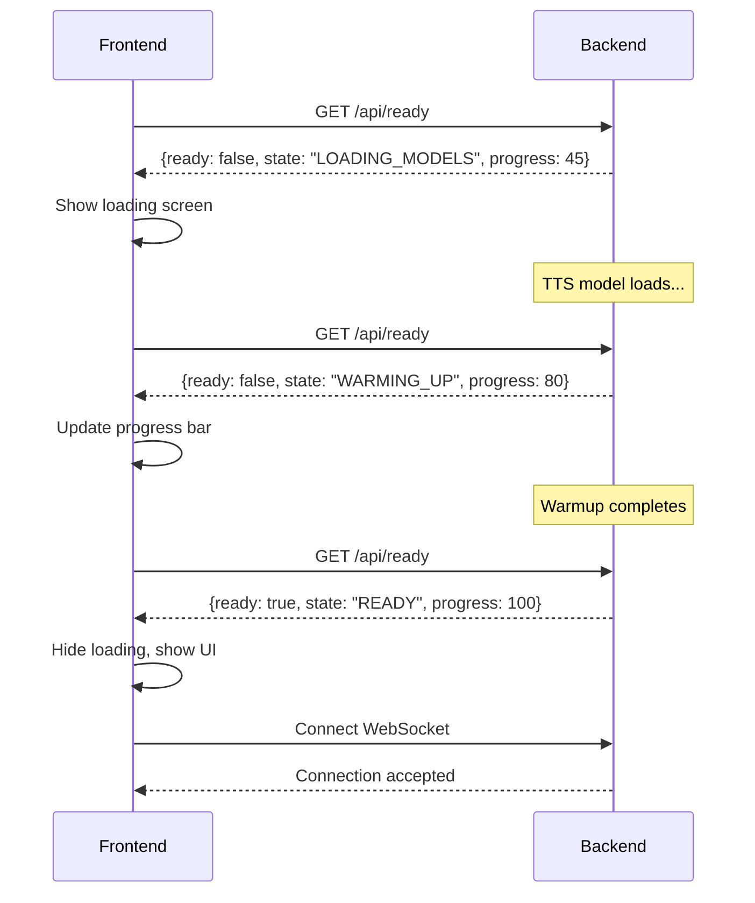

# Backend Readiness System - Comprehensive Plan

## Problem Statement

**Current Issues:**
1. ❌ Frontend doesn't know when backend is ready to accept requests
2. ❌ First WebSocket connection may fail if models still loading
3. ❌ `/api/health` only checks if services *can* work, not if they're *ready* to work
4. ❌ No visibility into initialization progress
5. ❌ Frontend might connect too early and get errors

## Solution: Comprehensive Readiness System

### Core Concept

**Health vs Ready:**
- **Health (`/api/health`)**: "Are the services installed and configured?"
- **Ready (`/api/ready`)**: "Are the models loaded and services warmed up?"

A service can be "healthy" but not "ready" (e.g., TTS model installed but not loaded yet).

---

## Implementation Plan

### 1. **ReadyState Manager** (NEW)

**File:** `app/services/ready_state.py`

Singleton class to track initialization state:

```python
class ReadyState:
    """Tracks backend readiness state."""
    
    States:
    - INITIALIZING: Backend starting up
    - LOADING_MODELS: Loading TTS/STT models
    - WARMING_UP: Running warmup tests
    - READY: All systems ready
    - ERROR: Initialization failed
    
    Tracks:
    - Overall state
    - Per-service status (tts, stt, chat)
    - Initialization progress (0-100%)
    - Error messages
    - Timing information
```

**Features:**
- Thread-safe state updates
- Subscribe to state changes (for SSE/WebSocket)
- Persist state in singleton
- Automatic timeout detection

---

### 2. **New `/api/ready` Endpoint**

**File:** `app/api/routes.py`

```python
@router.get("/ready")
async def check_ready():
    return {
        "ready": True/False,
        "state": "READY|INITIALIZING|LOADING_MODELS|WARMING_UP|ERROR",
        "progress": 0-100,
        "services": {
            "tts": {
                "ready": True,
                "loaded_at": "2024-02-20T10:30:45Z",
                "warmup_time_ms": 234.5
            },
            "chat": {
                "ready": True,
                "model": "llama3.2",
                "warmup_time_ms": 1523.2
            },
            "stt": {
                "ready": False,
                "reason": "not_installed"
            }
        },
        "startup_time_ms": 1825.7,
        "errors": []
    }
```

**Response Examples:**

**During initialization:**
```json
{
  "ready": false,
  "state": "LOADING_MODELS",
  "progress": 45,
  "services": {
    "tts": {"ready": false, "status": "loading"},
    "chat": {"ready": false, "status": "pending"},
    "stt": {"ready": false, "status": "pending"}
  },
  "startup_time_ms": null,
  "errors": []
}
```

**When ready:**
```json
{
  "ready": true,
  "state": "READY",
  "progress": 100,
  "services": {
    "tts": {"ready": true, "warmup_time_ms": 234.5},
    "chat": {"ready": true, "warmup_time_ms": 1523.2},
    "stt": {"ready": false, "reason": "not_installed"}
  },
  "startup_time_ms": 1825.7,
  "errors": []
}
```

**On error:**
```json
{
  "ready": false,
  "state": "ERROR",
  "progress": 30,
  "services": {
    "tts": {"ready": false, "error": "Out of memory"},
    "chat": {"ready": false, "error": "Ollama not responding"},
    "stt": {"ready": false, "reason": "not_installed"}
  },
  "startup_time_ms": null,
  "errors": [
    "TTS initialization failed: Out of memory",
    "Chat service unavailable: Ollama connection refused"
  ]
}
```

---

### 3. **Automatic Warmup on Startup**

**File:** `main.py` - Update `lifespan` function

```python
@asynccontextmanager
async def lifespan(app: FastAPI):
    logger.info("Starting application...")
    
    # Set state to INITIALIZING
    ReadyState.set_state("INITIALIZING")
    
    # Initialize services
    ReadyState.set_state("LOADING_MODELS", progress=10)
    await initialize_tts()  # Load TTS model
    
    ReadyState.set_state("LOADING_MODELS", progress=50)
    await initialize_stt()  # Load STT model
    
    ReadyState.set_state("LOADING_MODELS", progress=70)
    await initialize_chat()  # Check Ollama
    
    # Run warmup automatically
    ReadyState.set_state("WARMING_UP", progress=80)
    await warmup_services()
    
    # Mark as READY
    ReadyState.set_state("READY", progress=100)
    logger.info("Backend ready to accept connections")
    
    yield  # Application runs
    
    logger.info("Shutting down...")
```

**Benefits:**
- Models pre-loaded before first request
- Frontend gets immediate feedback
- No slow first connections

---

### 4. **Frontend Integration**

**File:** `VoiceLabs.ConversationWeb/Components/Pages/Home.razor`

**Loading Screen:**
```csharp
@if (!backendReady)
{
    <div class="loading-screen">
        <div class="spinner"></div>
        <h2>Initializing Backend...</h2>
        <div class="progress-bar">
            <div class="progress" style="width: @readyState.Progress%"></div>
        </div>
        <p>@readyState.State</p>
        
        @if (readyState.Services?.TTS?.Ready == true)
        {
            <p>✓ TTS Ready</p>
        }
        @if (readyState.Services?.Chat?.Ready == true)
        {
            <p>✓ Chat Ready (@readyState.Services.Chat.Model)</p>
        }
    </div>
}
else
{
    <!-- Normal UI -->
}
```

**Polling Logic:**
```csharp
protected override async Task OnInitializedAsync()
{
    // Poll /api/ready until backend is ready
    while (!backendReady)
    {
        try
        {
            var response = await http.GetFromJsonAsync<ReadyResponse>("/api/ready");
            readyState = response;
            backendReady = response.Ready;
            StateHasChanged();
            
            if (!backendReady)
            {
                await Task.Delay(1000); // Poll every second
            }
        }
        catch
        {
            await Task.Delay(2000); // Retry on error
        }
    }
    
    // Backend ready, now connect WebSocket
    await ConnectWebSocket();
}
```

---

### 5. **Server-Sent Events (Optional Enhancement)**

**File:** `app/api/routes.py`

Instead of polling, use SSE for push updates:

```python
@router.get("/ready/stream")
async def ready_stream():
    """Stream readiness updates via SSE."""
    async def event_generator():
        while True:
            state = ReadyState.get_state()
            yield f"data: {json.dumps(state)}\n\n"
            
            if state["ready"] or state["state"] == "ERROR":
                break
            
            await asyncio.sleep(0.5)
    
    return EventSourceResponse(event_generator())
```

**Frontend:**
```javascript
const eventSource = new EventSource('/api/ready/stream');
eventSource.onmessage = (event) => {
    const state = JSON.parse(event.data);
    updateUI(state);
    
    if (state.ready) {
        eventSource.close();
        connectWebSocket();
    }
};
```

**Benefits:**
- No polling overhead
- Real-time updates
- Better UX

---

### 6. **Enhanced Health Check**

Update `/api/health` to include ready status:

```python
@router.get("/health")
async def health_check():
    ready_state = ReadyState.get_state()
    
    return {
        "status": "healthy" if model_loaded else "unhealthy",
        "model_loaded": model_loaded,
        "stt_available": stt_available,
        "chat_available": chat_available,
        "ready": ready_state["ready"],  # NEW
        "ready_state": ready_state["state"]  # NEW
    }
```

**Why?**
- Aspire can use this for health checks
- Shows both health AND readiness
- Single endpoint for basic status

---

### 7. **Graceful Degradation**

Services can fail individually without blocking "ready":

```python
# TTS is required, must be ready
# Chat is required (for conversation)
# STT is optional

def calculate_ready_state():
    tts_ready = TTSService.is_model_loaded()
    chat_ready = ChatService.is_available()
    stt_ready = STTService.is_available()  # Optional
    
    # Backend is ready if critical services are ready
    return tts_ready and chat_ready
```

---

## File Structure

New files to create:
```
backend/
├── app/
│   ├── services/
│   │   ├── ready_state.py          # NEW - ReadyState manager
│   │   ├── warmup_service.py       # NEW - Centralized warmup logic
│   │   └── ...
│   └── api/
│       └── routes.py                # MODIFY - Add /ready endpoint
├── main.py                          # MODIFY - Auto-warmup on startup
└── ...
```

Frontend files to modify:
```
VoiceLabs.ConversationWeb/
├── Components/
│   ├── Pages/
│   │   └── Home.razor               # MODIFY - Add loading screen
│   └── Shared/
│       └── LoadingIndicator.razor   # NEW - Reusable loading component
└── Services/
    └── ReadyStateService.cs         # NEW - Ready state polling
```

---

## Implementation Steps

### Phase 1: Core Ready System (Essential)
1. ✅ Create `ReadyState` manager
2. ✅ Add `/api/ready` endpoint
3. ✅ Update `lifespan` to auto-warmup
4. ✅ Test with curl/Postman

### Phase 2: Frontend Integration (Essential)
5. ✅ Add polling logic to frontend
6. ✅ Create loading screen component
7. ✅ Hide UI until ready
8. ✅ Test end-to-end

### Phase 3: Enhanced UX (Nice to have)
9. ⭐ Add Server-Sent Events for real-time updates
10. ⭐ Add progress bar with per-service status
11. ⭐ Add retry logic for failed services
12. ⭐ Add manual "Retry Initialization" button

### Phase 4: Monitoring (Production)
13. 📊 Log ready state transitions
14. 📊 Track initialization times
15. 📊 Alert on startup failures
16. 📊 Metrics dashboard

---

## Benefits

### For Users:
✅ **Clear feedback** - Know when backend is ready  
✅ **No errors** - Won't try to connect before ready  
✅ **Progress visibility** - See what's loading  
✅ **Better UX** - Loading screen instead of silent wait  

### For Developers:
✅ **Easier debugging** - Clear state tracking  
✅ **Better logging** - State transitions logged  
✅ **Testability** - Can test ready state independently  
✅ **Monitoring** - Know how long startup takes  

### For Operations:
✅ **Health vs Ready** - Distinguish "broken" from "starting"  
✅ **Graceful startup** - Aspire knows when truly ready  
✅ **Automatic warmup** - No manual intervention  
✅ **Error visibility** - See what failed to load  

---

## API Comparison

| Endpoint | Purpose | When to Use |
|----------|---------|-------------|
| `/api/health` | Is the backend functioning? | Aspire health checks, monitoring |
| `/api/ready` | Is the backend ready for requests? | Frontend initialization, load balancers |
| `/api/warmup` | Force warmup of services | Manual testing, CI/CD |
| `/ws/test` | Is WebSocket working? | Debug connectivity |
| `/ws/conversation` | Full conversation flow | Production use |

---

## Example Flow



---

## Testing Strategy

### Unit Tests
```python
def test_ready_state_transitions():
    state = ReadyState()
    assert state.get_state() == "INITIALIZING"
    
    state.set_state("LOADING_MODELS")
    assert state.get_state() == "LOADING_MODELS"
    
    state.mark_service_ready("tts")
    assert state.is_service_ready("tts")

def test_ready_endpoint_response():
    response = client.get("/api/ready")
    assert "ready" in response.json()
    assert "state" in response.json()
    assert "services" in response.json()
```

### Integration Tests
```python
def test_auto_warmup_on_startup():
    # Start backend
    # Wait 5 seconds
    response = client.get("/api/ready")
    assert response.json()["ready"] == True
    assert response.json()["state"] == "READY"

def test_frontend_waits_for_ready():
    # Open frontend
    # Should show loading screen
    # Wait for backend ready
    # Loading screen should disappear
    # WebSocket should connect
```

---

## Configuration

Add to `appsettings.json`:
```json
{
  "Backend": {
    "AutoWarmup": true,
    "WarmupTimeout": 60000,
    "RequiredServices": ["tts", "chat"],
    "OptionalServices": ["stt"]
  }
}
```

---

## Rollout Plan

### Week 1: Backend
- Implement ReadyState manager
- Add /api/ready endpoint
- Add auto-warmup on startup
- Test thoroughly

### Week 2: Frontend
- Add polling logic
- Create loading screen
- Test with backend
- Handle errors gracefully

### Week 3: Polish
- Add SSE (optional)
- Improve error messages
- Add retry logic
- Performance testing

### Week 4: Production
- Deploy to staging
- Monitor startup times
- Gather feedback
- Deploy to production

---

## Success Metrics

- ✅ Frontend never connects before backend ready
- ✅ Startup time < 5 seconds
- ✅ Zero "service unavailable" errors on first request
- ✅ Clear visibility into initialization progress
- ✅ Graceful handling of service failures

---

## Questions to Consider

1. **Should we block on all services or only critical ones?**
   - Recommendation: TTS + Chat required, STT optional

2. **How long should we wait before timing out?**
   - Recommendation: 60 seconds, configurable

3. **Should we retry failed services automatically?**
   - Recommendation: No auto-retry, provide manual retry button

4. **Should we use polling or SSE?**
   - Recommendation: Start with polling (simpler), add SSE later

5. **What if Ollama goes down after startup?**
   - Recommendation: /api/ready stays "ready", but requests fail gracefully

---

## Conclusion

This comprehensive readiness system provides:

1. ✅ Clear separation between "health" and "ready"
2. ✅ Automatic warmup on startup
3. ✅ Progressive loading feedback
4. ✅ Graceful error handling
5. ✅ Better user experience
6. ✅ Easier debugging and monitoring

The implementation is modular and can be done in phases, with Phase 1 & 2 being essential, and Phase 3 & 4 being enhancements.

**Next Step:** Approve this plan, then I'll implement Phase 1 (Core Ready System).
